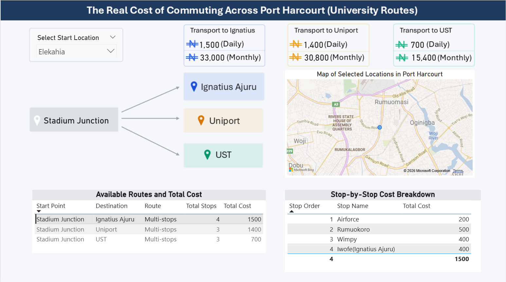

# Examples

This folder contains examples of completed project deliverables to help participants understand the expected outcome of the Transportation Cost Analysis Project.

## Sample Dashboard

The sample dashboard demonstrates one possible way of presenting the transportation data collected during the project.

It is intended as a source of inspiration rather than a required design template.

Participants are encouraged to design dashboards that best communicate the insights from their own data while following good data visualization and storytelling practices.

There is no single "correct" dashboard layout. Creativity and clear communication are encouraged.

## Tips

A good dashboard should:

- Present the most important KPIs clearly.
- Answer meaningful business questions.
- Include interactive filters where appropriate.
- Use charts that effectively communicate the data.
- Avoid unnecessary visual clutter.
- Tell a clear story supported by the data.

## Sample Dashboard

# Dashboard Demonstration

Watch the dashboard demo video here:

https://youtu.be/LWARCuIPmUE

The video provides an overview of the dashboard layout, key visualizations, and the insights that can be generated from the transportation dataset.